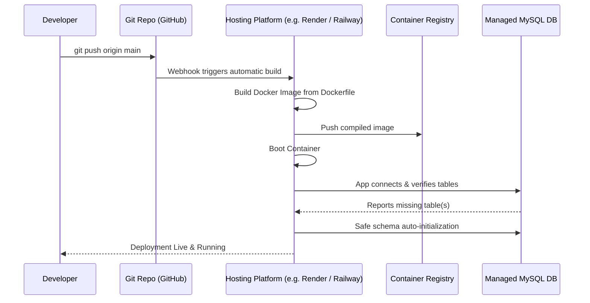

# AuraBudget - System Architecture & Technical Stack

This document describes the technical architecture, technology stack, and deployment pipeline for the **AuraBudget** application.

---

## 1. Project Architecture

The application implements a classic **Monolithic Single-Server Architecture** with a decoupled client-server structure running within the same process. It is organized into three distinct layers:

```mermaid
graph TD
    subgraph Client Layer "Client Layer (SPA Frontend)"
        UI[index.html / CSS] <--> Controller[app.js]
        Controller -->|Auth / Headers interceptor| Auth[JWT Client Storage]
        Controller -->|Chart rendering| Charts[Chart.js via CDN]
        Controller -->|Icons| Lucide[Lucide Icons via CDN]
    end

    subgraph Server Layer "Server Layer (Express Backend)"
        API[server.js - Express]
        Middleware[authenticateToken Middleware]
        Static[Static File Router]
        DBInit[Database Safe Schema & Migration Handler]
        API --> Middleware
    end

    subgraph Database Layer "Database Layer (Data Store)"
        MySQL[(MySQL Server)]
    end

    Controller <-->|REST API JSON / HTTP| API
    Controller <-->|Serves static files| Static
    API <-->|mysql2 connection pool| MySQL
    DBInit -->|Validates, creates & migrates tables| MySQL
```

### Key Architectural Concepts:
* **Single-Page Application (SPA)**: The browser loads `index.html` once. View switching between the Dashboard, Transactions, Budgets, Planner, and Admin sections is handled dynamically by `app.js` by manipulating the DOM (avoiding page reloads).
* **Multi-Tenant JWT Isolation**: Sessions are secured using JSON Web Tokens (JWT). The frontend's `fetch` API is globally intercepted to inject the token. All endpoints filter database queries dynamically by the authenticated user's ID.
* **Admin & User Role Permissions**: A dedicated Admin Panel is rendered in the UI for users with the `admin` role, providing system metrics and user management tools (creation, password reset, role editing, and account deletion with cascades).
* **Incremental Database Migration**: On boot, the server queries table schemas. If legacy tables exist but lack user-ownership columns, the database automatically alters the tables and assigns legacy records to the first registered admin user to prevent data loss.

---

## 2. Tech Stack

### Frontend (Client-side)
* **Structure & Markup**: HTML5 (Semantic elements)
* **Styling**: Vanilla CSS3 (featuring custom CSS properties, flexbox/grid layout systems, glassmorphism, and responsive breakpoints).
* **Logic**: Vanilla ES6+ JavaScript (leveraging a global fetch interceptor and JWT token handling).
* **Libraries (via CDN)**:
  * **[Chart.js](https://www.chartjs.org/)**: Renders interactive budget bar charts and expense distribution donut charts.
  * **[Lucide Icons](https://lucide.dev/)**: Dynamic vector icon renderer.

### Backend (Server-side)
* **Runtime**: [Node.js](https://nodejs.org/) (Version 20+ recommended)
* **Framework**: [Express](https://expressjs.com/) (Web framework handling static file hosting and routing).
* **Database Driver**: `mysql2/promise` (Provides a promise-based client supporting connection pooling and async/await syntax).
* **Libraries**:
  * `jsonwebtoken` (Generates and signs JWT authentication tokens)
  * `crypto` (Native PBKDF2 password hashing & salting module)
* **Environment Configuration**: `dotenv` (Loads config credentials from a `.env` file or environment variables).

### Database Layer
* **Storage Engine**: [MySQL](https://www.mysql.com/) (InnoDB engine supporting relational tables and foreign keys).
* **Schema Definition**: `schema.sql` defines six key tables:
  1. `users`: Credentials, password hash, and user role metadata.
  2. `settings`: Key-value configuration store per user (starting balance).
  3. `categories`: Custom expense categories with color, icon, and budget limits per user.
  4. `transactions`: Expense/Income statements linked to categories and users.
  5. `personal_notes`: Stream of notes and reminders per user.
  6. `checklist_tasks`: Interactive checklist system per user.


---

## 3. The Pipeline (Build & Deployment)

The deployment pipeline is built around standard containerization, allowing easy hosting on cloud platforms like **Render**, **Railway**, **AWS ECS**, or **Heroku**:



### Pipeline Steps:

1. **Local Setup & Development**:
   * Configurations are managed locally via `.env`.
   * Runs locally using `npm run dev` or directly with `node server.js`.

2. **Containerization (`Dockerfile`)**:
   * Uses `node:20-alpine` as a minimal parent base image to guarantee consistent runtime environments.
   * Runs `npm ci --only=production` to lock and install production dependencies, discarding devDependencies for a lighter image size.
   * Exposes port `3000` and launches via the `npm start` command.

3. **Cloud Build & Deployment**:
   * The host provider detects the pushed code changes on the `main` branch.
   * A build container parses the `Dockerfile` to compile the image.
   * Environment variables (like `DATABASE_URL` or `MYSQL_URL`) are injected into the hosting container dashboard.

4. **Startup Schema & Multi-Tenant Auto-Migration**:
   * During server boot-up, `server.js` initiates the database connection pool.
   * The server runs safe validation checks to verify if all required tables (`users`, `settings`, `categories`, `transactions`, `personal_notes`, `checklist_tasks`) exist in the database.
   * If any table is missing, the backend runs the non-destructive SQL parser to execute `schema.sql` sequentially.
   * The server then runs incremental migration scripts to check for the presence of the `user_id` column. If missing, it dynamically alters the tables and assigns legacy records to the first registered admin user, preventing any loss of pre-existing user data.
