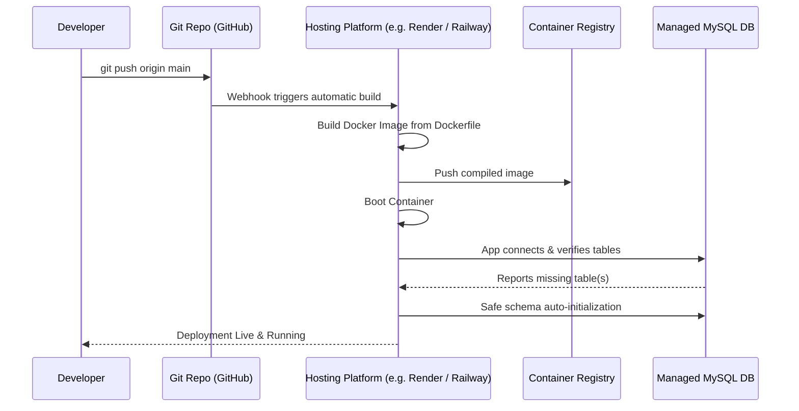

# AuraBudget - System Architecture & Technical Stack

This document describes the technical architecture, technology stack, and deployment pipeline for the **AuraBudget** application.

---

## 1. Project Architecture

The application implements a classic **Monolithic Single-Server Architecture** with a decoupled client-server structure running within the same process. It is organized into three distinct layers:

```mermaid
graph TD
    subgraph Client Layer "Client Layer (SPA Frontend)"
        UI[index.html / CSS] <--> Controller[app.js]
        Controller -->|Chart rendering| Charts[Chart.js via CDN]
        Controller -->|Icons| Lucide[Lucide Icons via CDN]
    end

    subgraph Server Layer "Server Layer (Express Backend)"
        API[server.js - Express]
        Static[Static File Router]
        DBInit[Database Safe Schema Checker]
    end

    subgraph Database Layer "Database Layer (Data Store)"
        MySQL[(MySQL Server)]
    end

    Controller <-->|REST API JSON / HTTP| API
    Controller <-->|Serves static files| Static
    API <-->|mysql2 connection pool| MySQL
    DBInit -->|Validates & creates tables| MySQL
```

### Key Architectural Concepts:
* **Single-Page Application (SPA)**: The browser loads `index.html` once. View switching between the Dashboard, Transactions, Budgets, and Planner sections is handled dynamically by `app.js` by manipulating the DOM (avoiding page reloads).
* **Stateless API Server**: `server.js` serves as a REST API gateway. It receives JSON requests from the frontend, executes queries on the database pool, and returns structured JSON responses.
* **Auto-Initialization (Migration-less)**: On boot, the server queries the database schema, checks for missing tables, and executes non-destructive queries from `schema.sql` if tables are missing. This makes deployment plug-and-play without manual migration steps.

---

## 2. Tech Stack

### Frontend (Client-side)
* **Structure & Markup**: HTML5 (Semantic elements)
* **Styling**: Vanilla CSS3 (featuring custom CSS properties, flexbox/grid layout systems, glassmorphism, and responsive breakpoints).
* **Logic**: Vanilla ES6+ JavaScript (leveraging async/await `fetch` APIs for database communication).
* **Libraries (via CDN)**:
  * **[Chart.js](https://www.chartjs.org/)**: Renders interactive budget bar charts and expense distribution donut charts.
  * **[Lucide Icons](https://lucide.dev/)**: Dynamic vector icon renderer.

### Backend (Server-side)
* **Runtime**: [Node.js](https://nodejs.org/) (Version 20+ recommended)
* **Framework**: [Express](https://expressjs.com/) (Web framework handling static file hosting and routing).
* **Database Driver**: `mysql2/promise` (Provides a promise-based client supporting connection pooling and async/await syntax).
* **Environment Configuration**: `dotenv` (Loads config credentials from a `.env` file or environment variables).

### Database Layer
* **Storage Engine**: [MySQL](https://www.mysql.com/) (InnoDB engine supporting relational tables and foreign keys).
* **Schema Definition**: `schema.sql` defines five key tables:
  1. `settings`: Key-value configuration store (starting balance).
  2. `categories`: Custom expense categories with color, icon, and budget limits.
  3. `transactions`: Expense/Income statements linked to categories via foreign keys.
  4. `personal_notes`: Stream of notes and reminders.
  5. `checklist_tasks`: Interactive checklist system.

---

## 3. The Pipeline (Build & Deployment)

The deployment pipeline is built around standard containerization, allowing easy hosting on cloud platforms like **Render**, **Railway**, **AWS ECS**, or **Heroku**:



### Pipeline Steps:

1. **Local Setup & Development**:
   * Configurations are managed locally via `.env`.
   * Runs locally using `npm run dev` or directly with `node server.js`.

2. **Containerization (`Dockerfile`)**:
   * Uses `node:20-alpine` as a minimal parent base image to guarantee consistent runtime environments.
   * Runs `npm ci --only=production` to lock and install production dependencies, discarding devDependencies for a lighter image size.
   * Exposes port `3000` and launches via the `npm start` command.

3. **Cloud Build & Deployment**:
   * The host provider detects the pushed code changes on the `main` branch.
   * A build container parses the `Dockerfile` to compile the image.
   * Environment variables (like `DATABASE_URL` or `MYSQL_URL`) are injected into the hosting container dashboard.

4. **Startup Schema Auto-Sync**:
   * During server boot-up, `server.js` initiates the database connection pool.
   * The server runs safe validation checks to verify if all 5 schema tables exist.
   * If any table is missing, the backend runs the non-destructive SQL parser to execute the statements in `schema.sql` sequentially, updating the schema without affecting preexisting user data.
